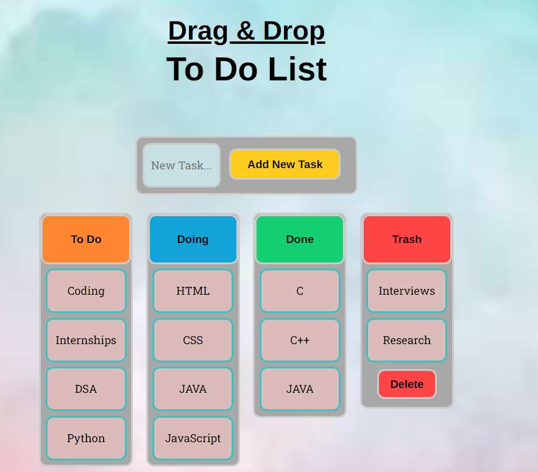

# 📝 To-Do List  

  

## 📌 Overview  
This **To-Do List Web App** helps users manage their daily tasks efficiently. It allows users to add, delete, and mark tasks as completed, ensuring better productivity and organization.  

## ✨ Features  
- ➕ **Add Tasks**: Quickly add new tasks.  
- ✅ **Mark as Complete**: Strike-through completed tasks.  
- ❌ **Delete Tasks**: Remove unnecessary tasks.  
- 🎨 **Responsive UI**: Works on all screen sizes.  
- 🔄 **Local Storage**: Saves tasks even after page refresh.  

## 🚀 Technologies Used  
- **HTML** - Structure of the web app  
- **CSS** - Styling and responsiveness  
- **JavaScript** - Dynamic interactions and local storage  

## 📂 Project Structure  
📁 To-Do-List

├── 📜 index.html # Main interface

├── 🎨 style.css # Styling file

├── 🛠️ script.js # JavaScript logic

├── 🖼️ logo.png # Application logo

├── 📜 README.md # Project documentation

## 🔧 Setup & Usage  
1. Clone the repository:  
   ```bash
   git clone https://github.com/Shivam0400/To-do-List.git
2. Open index.html in any web browser.
3. Start adding tasks and managing them efficiently!
   
## 🎯 Future Enhancements
✨ Dark Mode for better accessibility.
📅 Due Date Feature to set deadlines.
🔔 Notifications & Reminders for pending tasks.

## 💡 Contribution
Feel free to fork this project, raise issues, and submit pull requests.

### 🚀 Stay productive and organized with this To-Do List!


### Steps to Add:  
1. Create a `README.md` file in your repository (if not already present).  
2. Copy and paste the above content into it.  
3. Commit and push the changes to GitHub.  

Let me know if you'd like any modifications! 😊

